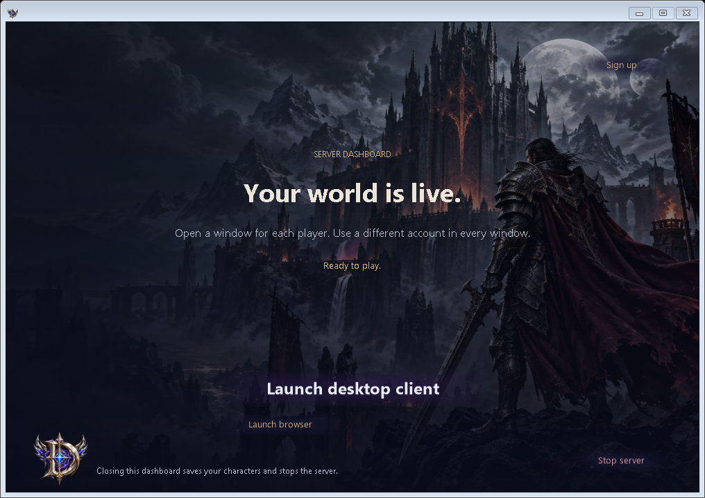
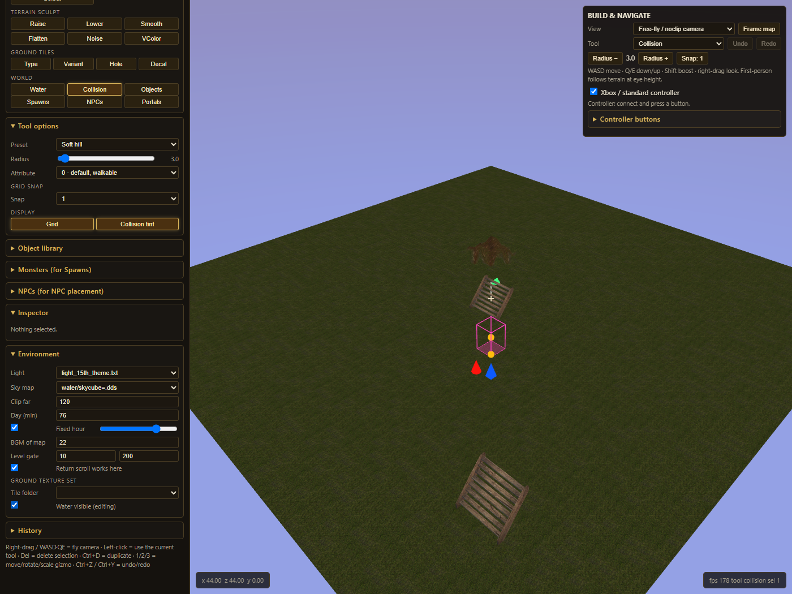
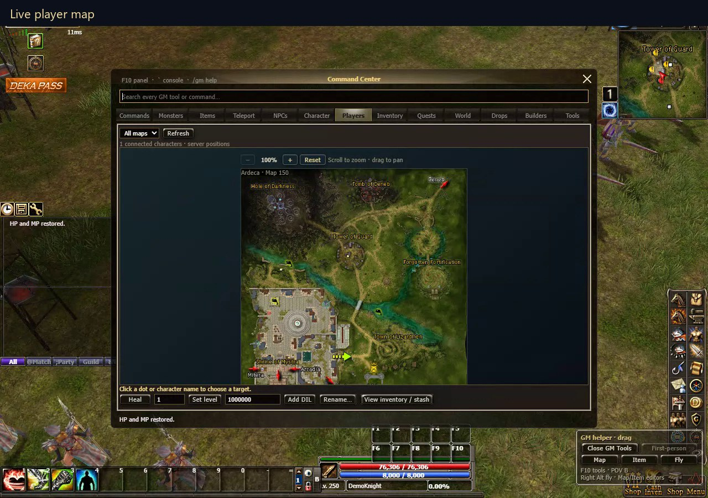
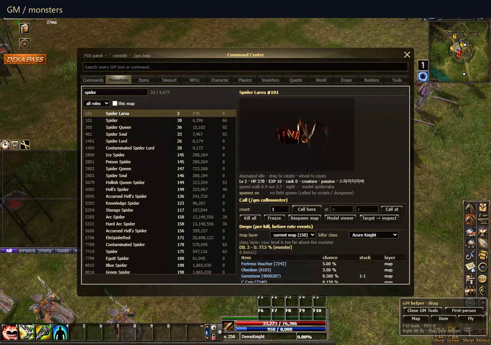

# Tools at a glance

Game imagery shown here is loaded from a separately supplied client. Original game assets are not included in the download. These images illustrate the interfaces; they are not benchmark or complete-gameplay acceptance evidence.

## Windows launcher

Current dashboard preview: choose a desktop client or browser, with an owned server that saves when stopped.

## Map Builder

Terrain, collision, objects, NPCs, spawns and portals, with keyboard/mouse and editor-only controller controls.

## Live player map

Example authenticated GM view from the demonstration build. Search and select players; use the permitted inspection and server operations. Ordinary accounts do not receive GM authority.

## Monster tools

Example searchable native catalog, animated model preview, spawn controls and source drop lookup. Individual native server scripts still have documented limits.

